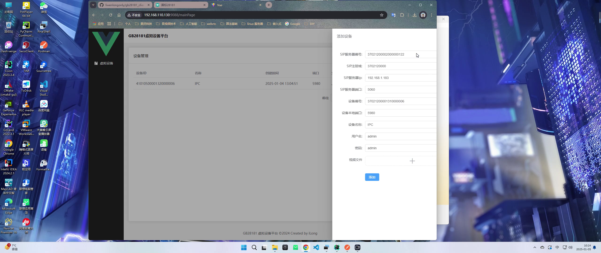

# gb28181_client

国标 gb28181 模拟客户端平台支持多设备, web端使用Vue + element-plus

- 支持 Linux

## 编译

```
cd gb28281_client

mkdir build && cd build
cmake ..
make -j8 && make install
```

## 运行
```
cd ./install/gb28281_client
./process_manager.sh start all
```
## 查看运行状态
```
./process_manager.sh status all
```
## 结束进程
```
./process_manager.sh stop all
```

## web端使用打包
```
cd ./web_src
npm install 
npm run build
```

## web端部署nginx使用做代理
```
server {
    listen       9088;
    server_name  localhost;

    charset utf-8; # 防止中文显示出现乱码

    client_max_body_size 1024M;  # 允许上传的最大文件大小为1024MB

    #access_log  logs/host.access.log  main;

    location / {
        root   /var/www/gb28181/html; # 你的静态资源路径
        index  index.html index.htm;# 访问的文件为html, htm
        try_files $uri /index.html;
    }

    location /baseurl {
        rewrite ^.+baseurl/?(.*)$ /gb28181/v1/$1 break;
        include uwsgi_params;
        proxy_pass   http://127.0.0.1:8089;
    }
}

```

